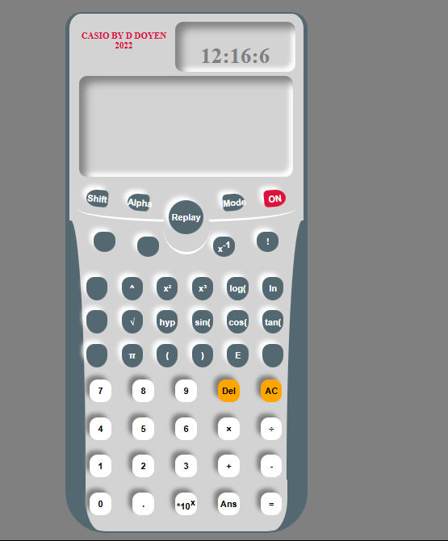

# Calculator Clone

This project is a simple clone of a CASIO calculator, created by D Doyen.

## Project Screenshot

## Features
- Basic arithmetic operations.
- Advanced functions: factorial, exponentiation, logarithms, trigonometric functions, etc.
- A live clock display in the header.
- Minimalistic UI built with HTML, CSS, and JavaScript.

## Usage

1. Open [index.html](c:\Users\oluwasola.ademola\Downloads\Calculator-main\index.html) in your browser.
2. Click the **ON** button to start the calculator.
3. Perform calculations using the provided buttons. Alerts will provide additional instructions.
4. Some buttons are inactive; refer to the alerts on page load for more details.

## Project Structure
- **index.html** – Main HTML file containing the layout.
- **index.css** – Styles for the calculator interface.
- **index.js** – JavaScript logic for calculations and UI interactions.

## Known Issues
- Inactive buttons for certain functions (e.g., Mode, Alpha, Replay).
- Strict input rules may prevent entering double arithmetic signs incorrectly.
- Minor bugs may occur; please report any issues you find.

## Author
CASIO by D Doyen
